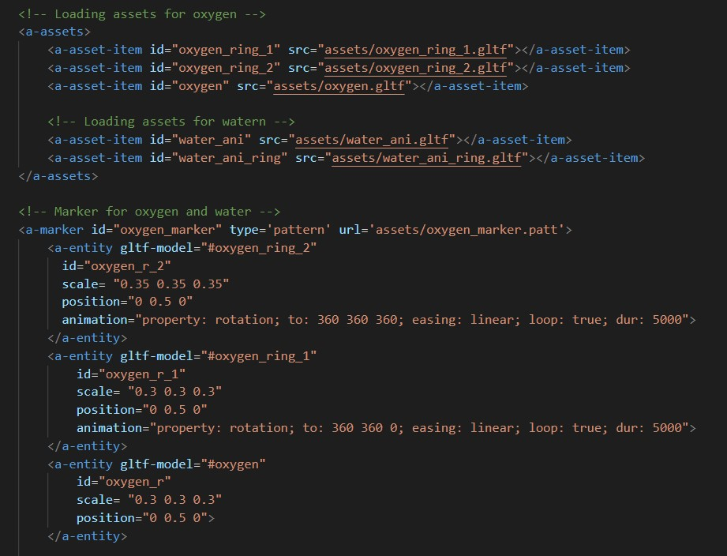

# Lesson: Interaction Design

### First and Last Name: Ευστράτιος Κουτουλάκης / Efstratios Koutoulakis
### University Registration Number: dpsd19061
### GitHub Personal Profile: [URL](https://github.com/dpsd19061)
### Augmented Reality Personal Repository: [URL](https://github.com/dpsd19061/Augmented-Reality)

# Index

### [Introduction](https://github.com/dpsd19061/Augmented-Reality/blob/main/my_report/README.md#introduction-1)

### [Summary](https://github.com/dpsd19061/Augmented-Reality/blob/main/my_report/README.md#summary-1)

### [1st Deliverable](https://github.com/dpsd19061/Augmented-Reality/blob/main/my_report/README.md#1st-deliverable-1)

### [2nd Deliverable](https://github.com/dpsd19061/Augmented-Reality/blob/main/my_report/README.md#2nd-deliverable-1)

[1o Κομμάτι 2ου Παραδοτέου](https://github.com/dpsd19061/Augmented-Reality/blob/main/my_report/README.md#1o-%CE%BA%CE%BF%CE%BC%CE%BC%CE%AC%CF%84%CE%B9-2%CE%BF%CF%85-%CF%80%CE%B1%CF%81%CE%B1%CE%B4%CE%BF%CF%84%CE%AD%CE%BF%CF%85)

[2o Κομμάτι 2ου Παραδοτέου](https://github.com/dpsd19061/Augmented-Reality/blob/main/my_report/README.md#2o-%CE%BA%CE%BF%CE%BC%CE%BC%CE%AC%CF%84%CE%B9-2%CE%BF%CF%85-%CF%80%CE%B1%CF%81%CE%B1%CE%B4%CE%BF%CF%84%CE%AD%CE%BF%CF%85)

[3o Κομμάτι 2ου Παραδοτέου](https://github.com/dpsd19061/Augmented-Reality/tree/main/my_report#3o-%CE%BA%CE%BF%CE%BC%CE%BC%CE%AC%CF%84%CE%B9-2%CE%BF%CF%85-%CF%80%CE%B1%CF%81%CE%B1%CE%B4%CE%BF%CF%84%CE%AD%CE%BF%CF%85)

### [3rd Deliverable](https://github.com/dpsd19061/Augmented-Reality/blob/main/my_report/README.md#3rd-deliverable-1)

[1o Κομμάτι 3ου Παραδοτέου](https://github.com/dpsd19061/Augmented-Reality/blob/main/my_report/README.md#1o-%CE%BA%CE%BF%CE%BC%CE%BC%CE%AC%CF%84%CE%B9-3%CE%BF%CF%85-%CF%80%CE%B1%CF%81%CE%B1%CE%B4%CE%BF%CF%84%CE%AD%CE%BF%CF%85)

[2o Κομμάτι 3ου Παραδοτέου](https://github.com/dpsd19061/Augmented-Reality/blob/main/my_report/README.md#2o-%CE%BA%CE%BF%CE%BC%CE%BC%CE%AC%CF%84%CE%B9-3%CE%BF%CF%85-%CF%80%CE%B1%CF%81%CE%B1%CE%B4%CE%BF%CF%84%CE%AD%CE%BF%CF%85)

[3o Κομμάτι 3ου Παραδοτέου](https://github.com/dpsd19061/Augmented-Reality/blob/main/my_report/README.md#3o-%CE%BA%CE%BF%CE%BC%CE%BC%CE%AC%CF%84%CE%B9-3%CE%BF%CF%85-%CF%80%CE%B1%CF%81%CE%B1%CE%B4%CE%BF%CF%84%CE%AD%CE%BF%CF%85)

### [Conclusions](https://github.com/dpsd19061/Augmented-Reality/blob/main/my_report/README.md#conclusions-1)

### [Sources](https://github.com/dpsd19061/Augmented-Reality/blob/main/my_report/README.md#sources-1)

# Introduction

# Summary

# 1st Deliverable

### Extra μη απαιτούμενα πράγματα που εκανα:
--> Άλλαξα κάποια πράγματα στο index.html που αφορά την αρχική σελίδα με τις επιλογές Marker Based, Location Based, Syros Location Based. Μετέφερα τις επιλογές στο κέντρο της οθόνης και μεγάλωσα τα γράμματα για ευκολότερη προσβασιμόσιτα κυρίως για το κινητό αλλά και για υπολογιστή.

### Επαυξημένη πραγματικότητα:
--> Αρχικά τοποθέτησα τον κύλινδρο και την σφαίρα από [εδω](https://aframe.io/docs/1.3.0/introduction/) χωρίς να αλλάξω πολύ τις διαστάσεις τους (τις άλλαξα αργότερα).

--> Στη συνέχεια τοποθέτησα το χιόνι από [εδω](https://www.npmjs.com/package/aframe-particle-system-component) και άλλαξα το μέγεθος των νιφάδων και την ποσότητα προκειμένου να φαίνεται πιο πλούσιο.

--> Από [εδω](https://www.npmjs.com/package/aframe-speech-command-component) βρήκα τον κώδικα για το speech command, τον τοποθέτησα στο αρχείο μου και τεστάροντας με τον local server που έφτιαξα κατάφερα να κάνω το χιόνι να εμφανίζεται και να εξαφανίζεται με τις φωνητικές εντολές start και stop.

--> Αργότερα το χιόνι μου έδωσε την έμπνευση να φτιάξω έναν χιονάνθρωπο με τα τρία αυτα σχήματα (κύλινδρος, σφαίρα, κύβος). Στην βάση χρησιμοποίησα έναν κύλινδρο με πολύ μικρό ύψος αλλά με μεγάλη ακτίνα και έναν κύβο ακριβώς από πάνω. Για το σώμα του χιονάνθρωπου χρησιμοποίησα τρείς σφαίρες την μία πάνω από την άλλη με διαφορετικό μέγεθος. Για τη μύτη του και τα χέρια του χρησιμοποίησα πάλι σαν βασικό σχήμα τον κύβο, όμως άλλαξα τις διαστάσεις με τέτοιο τρόπο ώστε να βρίσκονται στα σωστά σημεία.

--> Τα χρώματα τα πήρα από αυτό το [color picker](https://www.google.com/search?q=color+picker&rlz=1C1CHWL_elGR959GR959&oq=color+picker&aqs=chrome..69i57j0i512l9.4037j0j15&sourceid=chrome&ie=UTF-8)

### Αποτέλεσμα

# 2nd Deliverable

## 1o Κομμάτι 2ου Παραδοτέου

### Όνομα και Φωτογραφία

--> Αρχικά το πρώτο πράγμα που έκανα ήταν να φτιάξω από [εδώ](https://jeromeetienne.github.io/AR.js/three.js/examples/marker-training/examples/generator.html) τα τρία markers που θα χρησιμοποιήσω. Εναν για τον αριθμό μητρώου, έναν για το οξυγόνο και έναν για το υδρογόνο.

--> Στη συνέχεια, προγραμμάτισα τον marker για τον αριθμό μητρώου όπως φαίνεται στη παρακάτω εικόνα.

## 2o Κομμάτι 2ου Παραδοτέου

### Υδρογόνο

--> Για να φτίαξω το υδρογόνο, δημιούργησα ένα στατικό τρισδιάστατο μοντέλο στο blender και το έκανα export σε .gltf αρχείο προκειμένου να εμφανίζεται στον marker. Στο μοντέλο του υδρογόνου, για την ακρίβεα, εκανα export τρία διαφορετικά μοντέλα τα οποία τα φόρτωσα και τα έκανα animate ξεχωριστά με κώδικα. Αυτή η [σελίδα](https://aframe.io/docs/1.3.0/components/animation.html) με βοήθησε αρκετά στο πώς να το κάνω.

### Οξυγόνο

--> Οσον αφορά το οξυγόνο, ακολούθησα ακριβώς την ίδια διαδικασία με το υδρογόνο. Βέβαια, μεσα στο marker του οξυγόνου έχω φορτώσει και τα assets του νερού, όμως θα εξηγήσω το γιατί παρακάτω.

## 3o Κομμάτι 2ου Παραδοτέου

### Απόσταση των Marker και Νερό

--> Για να προγραμματίσω το τελευταίο κομμάτι του παραδοτέου με βοήθησε [αυτή](https://stackoverflow.com/questions/61239107/how-to-get-marker-position-x-y-ar-js?fbclid=IwAR1Sn5znFMi_lntPM_S7T3aLX5rdjE2Fj5HIk7CQtOUiaG6ZdR-dc5mFcss) και [αυτή](https://aframe.io/docs/0.8.0/introduction/writing-a-component.html) η σελίδα. Ο κώδικας που έχω γράψει σε javascript κάνει το εξής: Βρίσκει τις θέσεις των δύο marker και υπολοχίζει την από στασή τους. Στη συνέχεια με ένα if statement εμφανίζει και εξαφανίζει τα κατάληλα entities ανάλογα την απόσταση.

--> Τέλος στις δύο παρακάτω φωτογραφίες βλέπουμε τον τρόπο με τον οποίο καλώ το script που υπολογίζει την απόσταση ματαξύ των δύο marker και το πώς έχω κάνει animate το νερό, και ένα gif που δείχνει το πώς δουλεύει όλο το script. Όπως προανέφερα έβαλα τα entities του νερού μέσα στον marker του οξυγόνου έτσι ώστε να εμφανίζεται κάπου κοντά στα δύο marker.

# 3rd Deliverable 

## 1o Κομμάτι 3ου Παραδοτέου

### Τοποθεσία και 3D μοντέλο

--> Το animated 3D μοντέλο που έχω τοποθετήσει σε αυτό το κομμάτι της εργασίας είναι ένα αυτοκίνητο το οποίο το έχω σχεδιάσει ο ίδιος, με το blender, για ένα προσωπικό μου project που είχα κάνει πριν κάποιο καιρό. Στα πλαίσια της εργασίας έχω τοποθετήσει αυτό το αυτοκίνητο έξω από το κτίριο στο οποίο πραγματοποιείται η διεθνής έκθεση αυτοκινήτων στη Γενεύη, στην Ελβετία. Με λίγα λόγια το concept της ιδέας μου είναι να τοποθετήσω το αυτοκίνητο που έχω σχεδιάσει στην έκθεση.

--> Ο τρόπος που πραγματοποίησα αυτο το κομμάτι της εργασίας ήταν απλός. Αρχικά συμπίεσα το μοντέλο του αυτοκινήτου, διότι είχε πάρα πολλά πολύγωνα και το έκανα export σε αρχείο .gltf. Αργότερα το φόρτωσα στον κώδικα και έβαλα τις σωστές συντεταγμένες στο μοντέλο αλλά έβαλα και κοντινές συντεταγμένες στην προσομοιωμένη κάμερα. Τέλος έκανα το μοντέλο ένα απλό animation περιστροφής όπως είχα κάνει animate άλλα .gltf αρχεία στο δεύτερο παραδοτέο. Το αυτοκίνητο περιστρέφεται αργά και σταθερά σαν να βρίσκεται στην έκθεση και να παρουσιάζεται, όπως φαίνεται παρακάτω.

(Ενδεχομένως στα μοντέλα να φαίνονται κάποια σημεία πάνω στις επιφάνειές τους να τρεμοπαίζουν, αυτό συμβαίνει όταν δυο επιφάνεις βρίσκονται πολύ κοντά μεταξύ τους και είναι σε μια μεγάλη απόσταση από την κάμερα. Τα μοντέλα δεν έχουν κάποιο θέμα, έχει να κάνει με τον τρόπο που τα προβάλει το πρόγραμμα)

--> Εφόσον συμπίεσα αρκετά το αρχικό μοντέλο, παραθέτω και κάποιες φωτορεαλιστικές απεικονίσεις του αυτοκινήτου υψηλής ποιότητας.

## 2o Κομμάτι 3ου Παραδοτέου

### Click Event

--> Για να καταφέρω να εμφανίζω και να εξαφανίζω κείμενο κλικάροντας πάνω στο μοντέλο βοηθήθηκα υπερβολικά από αυτή τη [σελίδα](https://glitch.com/~salty-partner-1) διότι δίνει ακριβείς απαντήσεις στο ζητούμενο της εργασίας.

--> Χρησιμοποίησα λοιπόν αυτό το script το οποίο με λίγα λόγια κάνει toggle (ενεργοποιεί και απενεργοποιεί) το visibility του κειμένου κάθε φορά που κάνω κλίκ πάνω στο αυτοκίνητο.

--> Για να λειτουργήσει το script βάζω τις σωστές εντολές στα σωστά μέρη, όπως το text-show για να καλέσει το script και το class="click" και το class="clickable" για να γνωρίζει το πρόγραμμα σε τι entities θα ενεργήσει και πως. Το a-text ειναι εμφωλευμένο στο entity του αυτοκινήτου για να εμφανίζεται στη σωστή θεση, με βάση την θέση του αυτοκινήτου. Επιπλέον έχω κάνει animate το text να περιστρέφεται από την άντίθετη μεριά με την ίδια ταχύτητα έτσι ώστε αυτό να μένει ακίνητο και να μην περιστρέφεται.

--> Αυτό εδω είναι το αποτέλεσμα:

## 3o Κομμάτι 3ου Παραδοτέου

### Τοποθεσία στη Σύρο

--> Tο παρακάτω μοντέλο που έχω κάνει animate, είναι επίσης σχεδιασμένο από εμενα.

--> Αυτή τη φορά το animation έγινε μέσα από το blender διότι είναι πιο σύνθετο. Η βασική ιδέα μου είναι να κάνω το αυτοκίνητό μου να ολισθαίνει με δεξιοτεχνία (να κάνει drift). Οπότε αρχικά έκανα τις ρόδες να περιστρέφονται σε μεγάλη ταχύτητα, έχοντας τοποθετήσει όλο το μοντέλο στη σωστή θέση και μετα κάνοντας parent τις ρόδες με το υπόλοιπο σώμα περίστρεψα όλο το αυτοκίνητο γυρω από ένα σημείο. Με αυτόν τον τρόπο δίνω την ψευδαίσθηση οτι ολισθαίνει.

--> Τοποθετόντας τις συντεταγμένες της πλατείας Μιαούλη και φορτώνοντας το .gltf αρχείο στο πρόγραμμα, κατέβηκα με το κινητό μου στη πλατεία για να σιγουρέψω οτι το animation δουλεύει σωστά και οτι εμφανίζεται στο σωστό μέρος.

--> Τέλος, η φωτορεαλιστική απεικόνιση υψηλής ποιότητας για αυτό το μοντέλο:

# Conclusions

# Sources
https://aframe.io/docs/1.3.0/introduction/

https://www.npmjs.com/package/aframe-particle-system-component

https://www.npmjs.com/package/aframe-speech-command-component

https://jeromeetienne.github.io/AR.js/three.js/examples/marker-training/examples/generator.html

https://aframe.io/docs/1.3.0/components/animation.html

https://stackoverflow.com/questions/61239107/how-to-get-marker-position-x-y-ar-js?fbclid=IwAR1Sn5znFMi_lntPM_S7T3aLX5rdjE2Fj5HIk7CQtOUiaG6ZdR-dc5mFcss

https://aframe.io/docs/0.8.0/introduction/writing-a-component.html

https://glitch.com/~salty-partner-1
